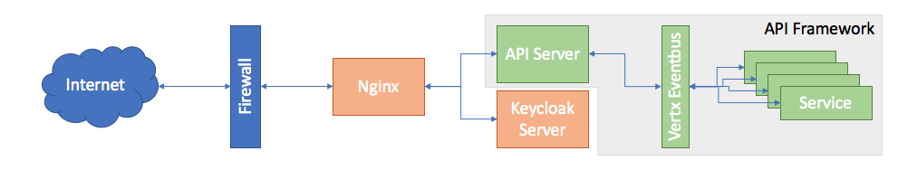
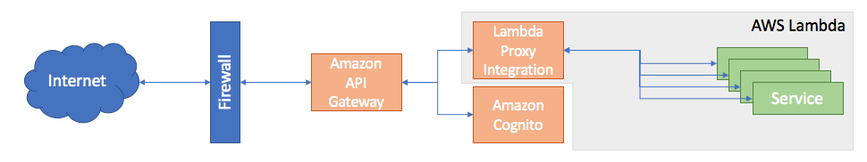

image::https://sonarcloud.io/api/project_badges/measure?project=vinscom_api-framework&metric=bugs[float="left"]
image::https://sonarcloud.io/api/project_badges/measure?project=vinscom_api-framework&metric=code_smells[float="left"]
image::https://sonarcloud.io/api/project_badges/measure?project=vinscom_api-framework&metric=coverage[float="left"]
image::https://sonarcloud.io/api/project_badges/measure?project=vinscom_api-framework&metric=duplicated_lines_density[float="left"]
image::https://sonarcloud.io/api/project_badges/measure?project=vinscom_api-framework&metric=ncloc[float="left"]
image::https://sonarcloud.io/api/project_badges/measure?project=vinscom_api-framework&metric=sqale_rating[float="left"]
image::https://sonarcloud.io/api/project_badges/measure?project=vinscom_api-framework&metric=alert_status[float="left"]
image::https://sonarcloud.io/api/project_badges/measure?project=vinscom_api-framework&metric=reliability_rating[float="left"]
image::https://sonarcloud.io/api/project_badges/measure?project=vinscom_api-framework&metric=security_rating[float="left"]
image::https://sonarcloud.io/api/project_badges/measure?project=vinscom_api-framework&metric=sqale_index[float="left"]
image::https://sonarcloud.io/api/project_badges/measure?project=vinscom_api-framework&metric=vulnerabilities[float="left"]

= API Framework
Vinay Kumar
v0.1

API Framework is structured code/pattern/project template for you to write API based
system using Vertx Framework (http://vertx.io/).

.Example API Framework Deployment

.Example AWS Lambda Deployment using API Framework

== Getting Started

- Project is built using https://vinscom.github.io/glue/[Glue] project
- Getting Started with https://vinscom.github.io/api-framework-start/[API Framework]
