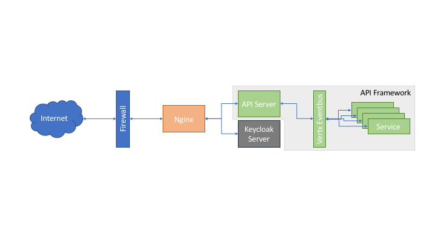

# api-framwork - draft
Vertx, Open API 3 and Open ID Connect (Keycloak) based framework for writing secure and scalable API



## Features
1. Full end-to-end stateless and stateful API framework based on Vertx.
2. Keycloak based API control.
3. OpenAPI 3 based API declaration
4. Vertx does not provide development pattern to develop complex application. API Framework provides full application configuration and development pattern.  Final build is ready for deployment on any cloud platform.
4. Reduce deployment complexity, Single codebase can be deployed on all system. And only required element can be enabled or disabled using configuration (No code change).
5. Scale up of application is easy and framework is cluster enable from starting.
6. Cloud ready
7. Component based development enable faster development

# Architecture

Before we go into detail. Lets me discuss some fundamental concepts based on which whole system is built.

## Configuration System
Very early standardisation of configuration system is very important. In desire to not tie codebase with any specific configuration system, we are building code where whole framework is using packed as a single jar. Hardcoding every single class dependency. And only way to fix any bug in code base of framework is to create Git Pull request on original codebase and expect it to be merged and released as part of release.

Concept of IoC have evolved longtime back. But, still not sure, why we are still building systems with ```new``` keyword.

Spring is one good system, but, too complicated, as it require reading of whole 100 page documentation, just to use it as configuration system. Also, its XML based configuration system is too complicated to handle 1000 components.

This project uses, its own configuration system **glue**. It is based on properties file and uses layer concept to override configuration. Look at **glue** and this project test cases.

This project has adopted simple philosophy of keeping everything configurable outside codebase.

## Cloud
Whole cloud infrastructure is evolving very fast. And in coming few years, we will see more and more standardisation of technology and concepts. In any case, our application must reflect few traits:

1. Final deployment build must be independent of external dependencies. 
	- A fully contained build is easy to deploy and manage. This means, gone are the days where installation of web server is prerequisite to run web application
2. Ability to assemble full application in minimum number of fully contained build.
	- Easier continuous code deployment.
3. Ability to configure system without changing codebase. From day one, whole system must be built in a way that all configuration and dependencies must be stored outside codebase.
	- A flexible configuration system ensure that we can activate and deactivate different system within same codebase as required. 
4. Application should be able to scale adopt easily for horizontal and vertical scaling.
	- Application should be able to scale according to demand.
