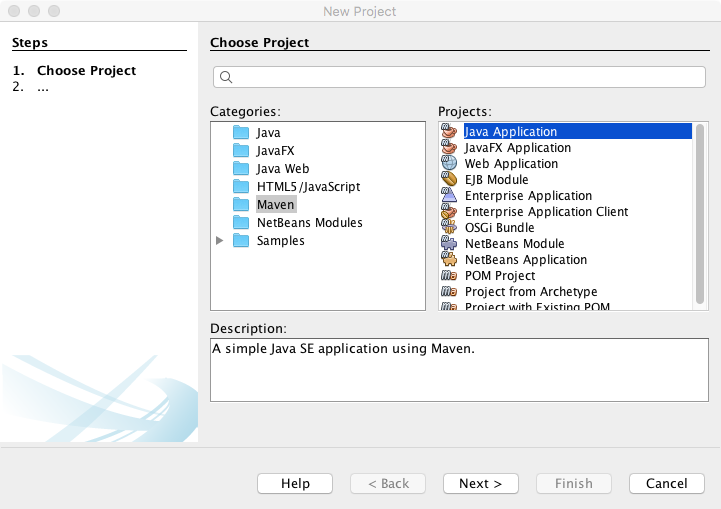
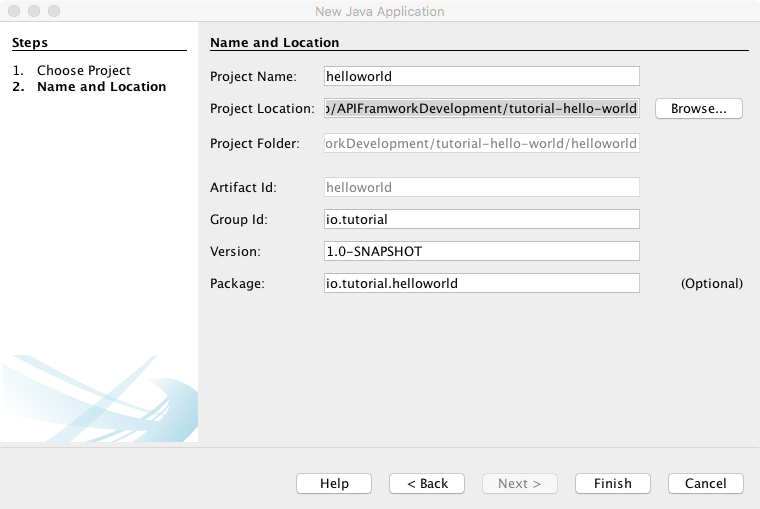

== Project setup in Netbean

NOTE: Below steps are optional. You can clone this project from
          https://github.com/vinscom/api-framwork-start.git

. Create Project Folder *helloworldservice*. This will be used as base folder.
. Create new project +

. Save project to *helloworldservice* location +

. Add required dependencies to POM
+
[source, xml]
----
<dependency>
    <groupId>in.erail</groupId>
    <artifactId>glue</artifactId>
    <version>1.0-SNAPSHOT</version>
</dependency>
<dependency>
    <groupId>in.erail</groupId>
    <artifactId>api-framwork</artifactId>
    <version>1.0-SNAPSHOT</version>
</dependency>
----
+
. Additional project dependencies
+
[source, xml]
----
<dependency>
    <groupId>io.vertx</groupId>
    <artifactId>vertx-unit</artifactId>
    <version>3.5.0</version>
    <scope>test</scope>
</dependency>
<dependency>
    <groupId>junit</groupId>
    <artifactId>junit</artifactId>
    <version>4.12</version>
    <scope>test</scope>
</dependency>
<dependency>
    <groupId>org.hamcrest</groupId>
    <artifactId>hamcrest-core</artifactId>
    <version>1.3</version>
    <scope>test</scope>
</dependency>
----

. Create *helloworldservice/config-layers/common* and
  *helloworldservice/config-layers/test* folder to store all configuration
+
NOTE: *common* configuration is for production use. *test* configuration can be
          used to add new or override *common* configuration during unit test

. Create *helloworldservice/src/assembly/common-config.xml*
+
[source, xml]
----
<?xml version="1.0" encoding="UTF-8"?>
<assembly xmlns="http://maven.apache.org/plugins/maven-assembly-plugin/assembly/1.1.2"
          xmlns:xsi="http://www.w3.org/2001/XMLSchema-instance"
          xsi:schemaLocation="http://maven.apache.org/plugins/maven-assembly-plugin/assembly/1.1.2 http://maven.apache.org/xsd/assembly-1.1.2.xsd">
    <id>common-config</id>
    <formats>
        <format>zip</format>
    </formats>
    <fileSets>
        <fileSet>
            <directory>${project.basedir}/config-layers/common</directory>
            <outputDirectory>/config</outputDirectory>
        </fileSet>
    </fileSets>
</assembly>
----
NOTE: This configuration will make sure that your *common* config layers is copied
          for production use.

. Add plugins to Maven
+
[source, xml]
----
<plugins>
    <plugin>
        <artifactId>maven-assembly-plugin</artifactId>
        <version>2.5.3</version>
        <executions>
            <execution>
                <id>create-archive</id>
                <phase>package</phase>
                <goals>
                    <goal>single</goal>
                </goals>
                <configuration>
                    <outputDirectory>${project.build.directory}/build</outputDirectory>
                    <descriptor>src/assembly/common-config.xml</descriptor>
                </configuration>
            </execution>
        </executions>
    </plugin>
    <plugin>
        <groupId>org.apache.maven.plugins</groupId>
        <artifactId>maven-surefire-plugin</artifactId>
        <version>2.20.1</version>
        <configuration>
            <argLine>-Dhazelcast.jmx=true -Dvertx.logger-delegate-factory-class-name=io.vertx.core.logging.Log4j2LogDelegateFactory -Dglue.layers=${project.basedir}/config-layers/common,${project.basedir}/config-layers/debug,${project.basedir}/config-layers/test</argLine>
        </configuration>
    </plugin>
    <plugin>
        <groupId>org.apache.maven.plugins</groupId>
        <artifactId>maven-dependency-plugin</artifactId>
        <version>2.9</version>
        <executions>
            <execution>
                <id>copy-dependencies</id>
                <phase>prepare-package</phase>
                <goals>
                    <goal>copy-dependencies</goal>
                </goals>
                <configuration>
                    <outputDirectory>${project.build.directory}/build/${project.artifactId}-${project.version}-lib/</outputDirectory>
                    <overWriteReleases>false</overWriteReleases>
                    <overWriteSnapshots>false</overWriteSnapshots>
                    <overWriteIfNewer>true</overWriteIfNewer>
                </configuration>
            </execution>
        </executions>
    </plugin>
    <plugin>
        <groupId>org.apache.maven.plugins</groupId>
        <artifactId>maven-jar-plugin</artifactId>
        <version>3.0.2</version>
        <configuration>
            <outputDirectory>${project.build.directory}/build</outputDirectory>
            <archive>
                <manifest>
                    <addClasspath>true</addClasspath>
                    <classpathPrefix>${project.artifactId}-${project.version}-lib/</classpathPrefix>
                    <mainClass>in.erail.glue.Boot</mainClass>
                </manifest>
            </archive>
        </configuration>
    </plugin>
</plugins>
----
+
